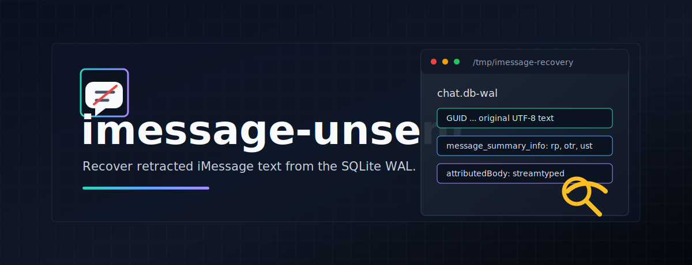
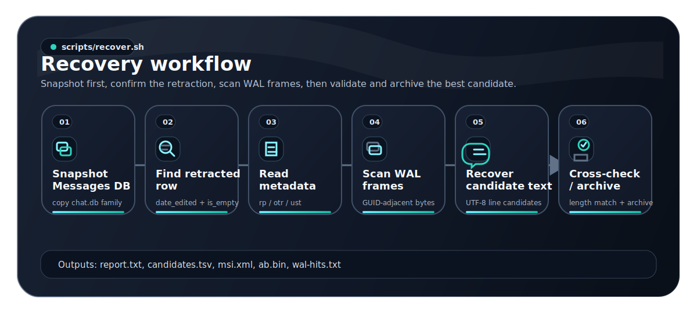

<div align="center">


# imessage-unsent

**Recover the original text of an iMessage another user "unsent" on macOS — by reading the SQLite WAL before it gets checkpointed.**

[](LICENSE)
[](#prerequisites)
[](#usage)
[](#limitations)



</div>

---

When someone unsends an iMessage on iOS 16+ / macOS 13+, Apple's client wipes the message body from `~/Library/Messages/chat.db` on both ends within ~2 minutes. The `text` and `attributedBody` columns are nulled; `message_summary_info` keeps only metadata (length, retracted-part indices). Everything you'd want is gone from the canonical row.

But SQLite doesn't overwrite pages in place — it writes new page images to a **write-ahead log** (`chat.db-wal`) and only later checkpoints them into the main file. For a window of seconds-to-hours after the unsend, the **pre-retract page image is still sitting in the WAL**, with the original UTF-8 text inline. This repo's script extracts it.

| | |
|---|---|
| **Platform** | macOS 15 / Sequoia (verified on Darwin 24.x) |
| **Languages** | bash, python3 |
| **Built-in deps** | `sqlite3`, `plutil` |
| **Optional deps** | [`typedstream`](https://pypi.org/project/typedstream/) (pip), [`imessage-exporter`](https://github.com/ReagentX/imessage-exporter) (cargo) |
| **Permission required** | Full Disk Access for your terminal |
| **License** | [MIT](LICENSE) |

## Table of contents

- [macOS Sequoia gotcha](#macos-sequoia-24x-gotcha--read-this-first)
- [How iMessage retraction actually works](#how-imessage-retraction-actually-works)
- [chat.db schema deep-dive](#chatdb-schema-deep-dive)
- [The six recovery vectors](#the-six-recovery-vectors)
- [Architecture diagrams](docs/architecture.md)
- [Recovery workflow](#recovery-workflow)
- [Why the WAL vector works (byte-level)](#why-the-wal-vector-works-byte-level)
- [Usage](#usage)
- [Run the daemon and menu bar app](#run-the-daemon-and-menu-bar-app)
- [Daemon control socket](#daemon-control-socket)
- [Sanitized case study](#sanitized-case-study)
- [Modes — Recover vs Restore](#modes--recover-vs-restore)
- [Limitations](#limitations)
- [Prerequisites](#prerequisites)
- [Privacy and legal](#privacy-and-legal)

---

## macOS Sequoia (24.x) gotcha — read this first

> [!WARNING]
> The `message` table in `chat.db` has a column called `date_retracted` that **looks like** the right place to detect unsends. **It is not used on macOS Sequoia (Darwin 24.x).** Apple records unsends via:
>
> `m.date_edited != 0  AND  m.is_empty = 1`
>
> If your forensic tool filters on `date_retracted != 0` (the obvious-but-wrong column), it will silently miss every retraction. The schema is misleading. Empirical truth is: **unsend = "edited to empty"**.

## How iMessage retraction actually works

When the sender taps "Undo Send" within the 2-minute window, the Messages client on every device that holds the conversation receives a retraction directive over APNS and applies an SQL `UPDATE` against the message row:

| Column                  | Before retraction              | After retraction       |
| ----------------------- | ------------------------------ | ---------------------- |
| `text`                  | the message string             | `NULL`                 |
| `attributedBody`        | typedstream NSAttributedString | 0 bytes / `NULL`       |
| `is_empty`              | 0                              | 1                      |
| `date_edited`           | 0                              | non-zero (Apple epoch) |
| `date_retracted`        | 0                              | 0 (unused on Darwin 24) |
| `message_summary_info`  | typically `NULL`               | small bplist (~100 B)  |

The `message_summary_info` BLOB is a binary plist that records *what was retracted*, not *what it said*:

```xml
<dict>
  <key>amc</key><integer>0</integer>            <!-- associated message count -->
  <key>otr</key>                                 <!-- original text ranges -->
  <dict>
    <key>0</key>                                 <!-- part index 0 -->
    <dict>
      <key>le</key><integer>95</integer>         <!-- original length: 95 chars -->
      <key>lo</key><integer>0</integer>          <!-- original offset: 0 -->
    </dict>
  </dict>
  <key>rp</key><array><integer>0</integer></array> <!-- retracted parts: [0] -->
  <key>ust</key><true/>                           <!-- user-sent text marker -->
</dict>
```

So the metadata tells you "a 95-character user-sent text was retracted in full" — but not what those 95 characters were. The bytes are scrubbed from the row.

> [!NOTE]
> For *edited* messages (Apple's other "edit message" feature), this same plist gains an `ec` (edit chronology) key with prior versions — including their typedstream blobs. **Edits preserve history; retractions do not.**

## chat.db schema deep-dive

<details>
<summary><b>Relevant columns of <code>message</code> on Darwin 24.6 (click to expand)</b></summary>

| Column                  | Type    | Purpose                                              |
| ----------------------- | ------- | ---------------------------------------------------- |
| `ROWID`                 | INTEGER | Primary key                                          |
| `guid`                  | TEXT    | Stable message GUID (UUID format)                    |
| `text`                  | TEXT    | Plain message text (often `NULL` when `attributedBody` populated) |
| `attributedBody`        | BLOB    | NSKeyedArchiver typedstream of NSAttributedString    |
| `service`               | TEXT    | `iMessage` / `SMS` / `RCS`                           |
| `account`               | TEXT    | Account that received the message                    |
| `handle_id`             | INTEGER | FK → `handle.ROWID` (the *other* party for inbound)  |
| `date`                  | INTEGER | Send time. Apple-epoch nanoseconds (since 2001-01-01 UTC) |
| `date_read`             | INTEGER | Read receipt time, same epoch                        |
| `date_delivered`        | INTEGER | Delivery time, same epoch                            |
| `date_edited`           | INTEGER | **Non-zero on edits AND retractions** (Apple-epoch ns) |
| `date_retracted`        | INTEGER | Schema column reserved for retractions; **unused on Darwin 24** |
| `is_empty`              | INTEGER | `1` after retraction (also `1` for some empty system messages) |
| `is_from_me`            | INTEGER | `1` if sent by the local user, `0` if received       |
| `is_delivered`          | INTEGER | Delivery flag                                         |
| `message_summary_info`  | BLOB    | Binary plist with edit/retraction metadata           |
| `payload_data`          | BLOB    | App-specific (sticker / link preview / business chat) |
| `associated_message_guid` | TEXT  | For tapbacks/replies, points at the parent           |

</details>

Other tables you'll need:

- `handle (ROWID, id, country, service, ...)` — `handle.id` is the phone number (E.164) or Apple ID email.
- `chat (ROWID, guid, chat_identifier, display_name, service_name, ...)` — `display_name` is `NULL` for 1:1 chats and only set for named groups. Look up by `chat_identifier` or via `chat_handle_join`.
- `chat_handle_join (chat_id, handle_id)` — many-to-many.
- `chat_message_join (chat_id, message_id, message_date)` — many-to-many.

### Apple-epoch conversion

`date / 1000000000 + 978307200` converts the integer to Unix epoch seconds. `978307200` is the Unix timestamp of `2001-01-01 00:00:00 UTC`. SQLite expression:

```sql
datetime(m.date/1000000000 + 978307200, 'unixepoch', 'localtime')
```

> [!NOTE]
> Older versions of macOS (< 10.13) stored `date` as Apple-epoch *seconds* not nanoseconds — irrelevant for current builds, but watch for it on archived databases.

### Why `display_name` is a trap

On 1:1 conversations `chat.display_name` is `NULL`. The contact name shown in Messages.app is resolved on the fly from macOS Contacts (`Contacts.app` / AddressBook framework), **not** stored in `chat.db`. Search by handle:

```sql
SELECT c.ROWID
FROM chat c
JOIN chat_handle_join chj ON chj.chat_id = c.ROWID
JOIN handle h            ON h.ROWID     = chj.handle_id
WHERE h.id = '+15551234567' AND c.chat_identifier = '+15551234567'
ORDER BY c.ROWID LIMIT 1;
```

## The six recovery vectors

Run them in order. Stop at the first hit. For the per-vector technical reference (exact code paths, files written, failure modes, byte-level subtleties), see [`docs/recovery-vectors.md`](docs/recovery-vectors.md).

### Vector 0 — freeze state immediately

The chat.db family is hot. Any new Messages activity rewrites the WAL; auto-checkpoint compacts older frames into the main file and discards them. Before doing anything else:

```bash
osascript -e 'quit app "Messages"'
mkdir -p /tmp/imessage-recovery
cp ~/Library/Messages/chat.db     /tmp/imessage-recovery/
cp ~/Library/Messages/chat.db-wal /tmp/imessage-recovery/
cp ~/Library/Messages/chat.db-shm /tmp/imessage-recovery/
```

All subsequent reads target the snapshot. Do not reopen Messages.app until you've extracted what you need.

### Vector 1 — locate the chat by handle, find the candidate row

The unsent message will have `is_from_me = 0`, `date_edited != 0`, `is_empty = 1` for inbound retractions:

```sql
SELECT m.ROWID, m.guid,
       datetime(m.date/1000000000 + 978307200,'unixepoch','localtime')        AS sent_at,
       datetime(m.date_edited/1000000000 + 978307200,'unixepoch','localtime') AS edited_at,
       length(m.attributedBody)       AS ab_len,
       length(m.message_summary_info) AS msi_len
FROM message m
JOIN chat_message_join cmj ON cmj.message_id = m.ROWID
WHERE cmj.chat_id = :chat_rowid
  AND m.is_from_me = 0
  AND m.date_edited != 0
  AND m.is_empty = 1
ORDER BY m.date DESC LIMIT 10;
```

Pick the row whose `edited_at` aligns with when you saw the "X unsent a message" placeholder.

### Vector 2 — decode `message_summary_info`

Confirms the retraction and tells you the original length:

```bash
sqlite3 -readonly chat.db \
  "SELECT writefile('msi.bin', message_summary_info) FROM message WHERE ROWID=:id;"
plutil -convert xml1 -o msi.xml msi.bin
plutil -p msi.bin     # human-readable
```

Look for `rp` (retracted parts), `otr.0.le` (original character length), `ust = true` (was user-sent text). For pure retractions, **the original text bytes are not here** — only metadata.

### Vector 3 — decode `attributedBody`

The `attributedBody` BLOB is **not** a plist. It's an old-school typedstream (NSKeyedArchiver in pre-plist format) containing an `NSAttributedString`. Decode in Python:

```python
import typedstream  # pip install typedstream
with open('ab.bin', 'rb') as f:
    obj = typedstream.unarchive_from_data(f.read())
# obj is an NSAttributedString graph; walk for NSString
```

For fully retracted messages this BLOB is `NULL` or 0 bytes. Confirm and move on.

### Vector 4 — `chat.db-wal` byte forensics (the one that wins)

This is where the original text usually lives. See [Why the WAL vector works](#why-the-wal-vector-works-byte-level) below for the byte-level explanation.

Quick check — does the candidate's GUID appear in the WAL?

```bash
GUID=$(sqlite3 -readonly chat.db "SELECT guid FROM message WHERE ROWID=:id;")
grep -aob "$GUID" chat.db-wal     # lists offsets
```

If you get hits, extract the bytes immediately following each occurrence (see Python snippet in the next section).

### Vector 5 — `imessage-exporter` cross-check

[ReagentX/imessage-exporter](https://github.com/ReagentX/imessage-exporter) parses `attributedBody` and `message_summary_info` and surfaces edits/unsends. It respects the same scrubbing Apple does — for full retractions it reports the message as `Unsent` without recovering text. Useful as a sanity check; don't expect new content from it.

```bash
imessage-exporter -f txt -o ./export -p ./chat.db -c full
grep -RIn "$GUID" export/
```

### Vector 6 — external backups

<details>
<summary>If Vectors 0–5 fail and you genuinely need the text (click to expand)</summary>

- **Time Machine** — `tmutil listbackups`. Mount an older backup and pull a `chat.db` from before the unsend. Most reliable when configured.
- **APFS local snapshots** — `tmutil listlocalsnapshots /`. Mount and copy.
- **iPhone backup** — `~/Library/Application Support/MobileSync/Backup/<UUID>/3d/3d0d7e5fb2ce288813306e4d4636395e047a3d28` is the iPhone's `sms.db`. If the phone synced after the message arrived but before the unsend propagated, it's intact there. Encrypted backups must be decrypted outside this tool first.
- **iMazing / iExplorer / 3uTools** — third-party iPhone backup managers store at their own paths.
- **iCloud Backup** — recoverable only via full restore, generally not worth it for one message.

</details>

## Recovery workflow



This diagram mirrors `scripts/recover.sh`: snapshot the live Messages database family, resolve the target handle and candidate row, dump the retraction metadata, scan `chat.db-wal` for GUID-adjacent pre-retract text, then cross-check length and exporter output when available.

## Why the WAL vector works (byte-level)

SQLite in **WAL journaling mode** (the default for `chat.db`) writes new transactions to `chat.db-wal` instead of mutating the main file in place. The WAL has this structure:

```
+-------------------+
| WAL header (32 B) |
+-------------------+
| frame 1 header    |  24 bytes: page_number, db_size_after, salts, checksum
+-------------------+
| frame 1 page      |  page_size bytes (default 4096) — full snapshot of the page
+-------------------+
| frame 2 header    |
+-------------------+
| frame 2 page      |
+-------------------+
        ...
```

Every transaction's modified pages are appended as full page images. Reads that follow walk the WAL backwards and use the most-recent frame for each page; the older frames stay in the file until SQLite **checkpoints** the WAL into the main `.db` (default trigger: ~1000 pages, ~1 MB at 4 KB page size, configurable via `wal_autocheckpoint`).

When a message is retracted, two transactions hit the same page:

1. **INSERT** of the message row when it arrived. Page image written to WAL with `text = '...'` and `attributedBody = <typedstream>`.
2. **UPDATE** moments later that nulls `text`, zeroes `attributedBody`, sets `is_empty=1`, populates `message_summary_info`. New page image written to WAL.

If the WAL hasn't checkpointed in between, **both versions of that page coexist in the WAL right now**. The latest is what SQLite reads via the API; the older one is forensic gold.

### Where the text lives, byte-for-byte

SQLite stores rows as records on B-tree pages. The `message` row layout in serialized form is roughly:

```
[record header: column types]   [column values, in declared order]
```

Column types are encoded as varints; for our purposes the relevant column values are:

- `guid` — 36-byte ASCII string (TEXT serial type = `2*N + 13` where N = 36)
- `text` — variable-length UTF-8 (TEXT serial type = `2*N + 13`)
- `attributedBody` — BLOB starting with `\x04\x0bstreamtyped` (typedstream magic)

So immediately after the GUID's 36 ASCII bytes, the `text` column's bytes are inline UTF-8. The `attributedBody` BLOB begins at `\x04\x0bstreamtyped`. Therefore:

```python
# data[guid_offset+36 : guid_offset+36+text_length]  → the original text bytes
# (text_length is recoverable from the record header, but it's easier to scan
#  forward to the streamtyped magic which immediately follows)
```

The recovery script does exactly this. For each occurrence of the GUID in the WAL:

```python
after = data[guid_offset + 36 : guid_offset + 36 + 512]
end   = after.find(b'\x04\x0bstreamtyped')
text  = after[:end].lstrip(b'\x00\x01\x02\x03').decode('utf-8')
```

Multiple GUID hits = multiple page-image versions. Frames where `text` is empty correspond to the post-retraction state; frames where `text` contains real bytes are pre-retraction.

> [!TIP]
> **Length cross-check.** The recovered string's `len(text)` should match `otr.0.le` from the `message_summary_info` plist. If they match exactly, you have the right bytes.

## Usage

```bash
git clone git@github.com:tyhallcsu/imessage-unsent.git
cd imessage-unsent

# (one-time) grant your terminal Full Disk Access:
#   System Settings → Privacy & Security → Full Disk Access → +

# Run against the contact's phone (E.164) or Apple ID email
./scripts/recover.sh --handle '+15551234567'
# or
./scripts/recover.sh --handle 'someone@icloud.com'

# Machine-readable output for automation
./scripts/recover.sh --handle '+15551234567' --json

# Also check an iPhone backup if WAL recovery misses
./scripts/recover.sh --handle '+15551234567' --include-iphone-backup --json
./scripts/recover.sh --handle '+15551234567' --include-iphone-backup /path/to/backup --json

# Batch scan all handles with recent inbound retractions
./scripts/recover.sh --all-handles --since 24h --json

# Batch scan a curated list, one handle per line
./scripts/recover.sh --handles-file handles.txt --since 7d --json

# Preview batch scope without quitting Messages or snapshotting chat.db
./scripts/recover.sh --handles-file handles.txt --dry-run

# Read the report
cat /tmp/imessage-recovery/report.txt

# Optional: install the typedstream decoder for richer Vector 3 output
pip3 install --user typedstream
# Optional: install the cross-check tool for Vector 5
cargo install imessage-exporter
```

The script writes everything under `/tmp/imessage-recovery/` (override with `--work /path`):

| File                       | Content                                                |
| -------------------------- | ------------------------------------------------------ |
| `report.txt`               | Full vector-by-vector log                              |
| `chat.db`, `chat.db-wal`, `chat.db-shm` | Forensic snapshot                         |
| `candidates.tsv`           | Top 10 unsent candidates in the chat                   |
| `batch-handles.txt` / `batch-results.tsv` | Batch-mode scan inputs/results          |
| `batch-state.tsv`          | Batch-mode 60 second rate-limit state                  |
| `msi.bin` / `msi.xml`      | The retraction metadata plist                          |
| `ab.bin`                   | The (usually empty) attributedBody BLOB                |
| `wal-hits.txt`             | **Recovered text candidates from the WAL**             |
| `wal-candidates.json`      | WAL candidates used to build `--json` output           |
| `iphone-backup.json`       | Optional iPhone backup vector result                   |
| `export/` (if installed)   | imessage-exporter output                               |

For third-party iPhone backup locations, create `~/.config/imessage-unsent/iphone-backup-paths.txt` with one backup directory or direct `sms.db` path per line. `--include-iphone-backup` auto-discovery scans both MobileSync backups and those configured paths.

## Run the daemon and menu bar app

The CLI above is a one-shot recovery tool. The continuously-running watcher daemon + menu-bar app give you the same recovery automatically the moment a sender unsends a message — without you having to run anything by hand.

```bash
# Build + install the user LaunchAgent (writes to ~/Library/LaunchAgents and
# bootstraps it under your gui session). Idempotent — safe to re-run.
make daemon-install

# Build + launch the menu-bar app (no Dock icon, just a menu-bar status item).
make gui-run
```

Now grant Full Disk Access **to the installed daemon binary** (not the build-tree binary) so it can read `~/Library/Messages/chat.db`:

```
System Settings → Privacy & Security → Full Disk Access → +
  ~/Library/Application Support/imessage-unsent/bin/imu-watcher
```

The menu-bar icon flips from `xmark.octagon` (Daemon Down) to `checkmark.circle` (Watching) within ~2 seconds of the daemon being able to start. From there:

- **"Open History"** → window listing recovered messages, "Open archive" reveals the archive folder in Finder.
- **"Open Settings"** → daemon status, version, uptime, recovery count, last error, data dir.
- The daemon also fires a native macOS notification on each recovery (the first one will trigger the macOS notification permission prompt).

Where things live after `make daemon-install`:

| Path                                                              | Purpose                                  |
| ----------------------------------------------------------------- | ---------------------------------------- |
| `~/Library/LaunchAgents/com.imu.watcher.plist`                    | LaunchAgent definition                   |
| `~/Library/Application Support/imessage-unsent/bin/imu-watcher`   | Installed daemon binary                  |
| `~/Library/Application Support/imessage-unsent/scripts/`          | Copy of `scripts/` used by recovery      |
| `~/Library/Application Support/imessage-unsent/archives/`         | One subdirectory per recovery (mode 0700)|
| `~/Library/Application Support/imessage-unsent/daemon.sock`       | Read-only control socket (mode 0600)     |
| `~/Library/Logs/imessage-unsent/watcher.log`                      | Daemon stdout + stderr                   |
| `~/.config/imessage-unsent/config.toml`                           | Optional config (defaults are fine)      |

Tail the daemon log:

```bash
tail -f ~/Library/Logs/imessage-unsent/watcher.log
```

Uninstall (`launchctl bootout` + remove plist + remove installed binary/scripts):

```bash
make daemon-uninstall
```

Other useful targets:

```bash
make daemon-build    # swift build daemon -c release (no install)
make gui-build       # swift build gui -c release (no app bundle)
make swift-test      # daemon + gui swift test in one shot
```

## Daemon control socket

When the watcher daemon is running it serves a **read-only** Unix-domain socket at `~/Library/Application Support/imessage-unsent/daemon.sock` (mode `0600`, same-user only). The menu-bar app uses it to render status and the recovery history; you can also probe it directly:

```bash
# liveness check
echo '{"op":"ping"}' | nc -U ~/Library/Application\ Support/imessage-unsent/daemon.sock
# {"ok":true,"pong":true}

# daemon status
echo '{"op":"status"}' | nc -U ~/Library/Application\ Support/imessage-unsent/daemon.sock
# {"ok":true,"status":{"data_dir":"...","last_error":null,"last_wal_change_at":"...",
#  "last_wal_size":4096,"notifications_show":true,"recovery_count":3,"started_at":"...",
#  "state":"watching","uptime_seconds":42,"version":"0.2.0"}}

# most recent recoveries (limit 1..50, default 5)
echo '{"op":"recent","limit":3}' | nc -U ~/Library/Application\ Support/imessage-unsent/daemon.sock
# {"ok":true,"recoveries":[{"archive_path":"...","detected_at":"...","error":null,
#  "handle":"+15551234567","id":"2026-04-30T120000Z-101","recovered":true,"rowid":101,
#  "text":"the recovered message text"}, ...]}
```

Wire format: newline-delimited JSON, one request → one response → server closes the connection. Legacy plaintext `ping` is still accepted for one release.

The dispatcher is a hard allowlist of `ping`, `status`, and `recent`. Anything else (`restore`, `delete`, anything novel) returns:

```json
{"ok":false,"error":{"code":"read_only","message":"op X is not permitted: control server is read-only"}}
```

This is the IPC-boundary half of the Notify-only invariant — see [How the guardrail is enforced](#how-the-guardrail-is-enforced) for the file-layer half.

## Sanitized case study

A live recovery on macOS 24.6 (April 2026):

1. **Pre-flight.** `chat.db` 869 MB, `chat.db-wal` 3.3 MB (~812 frames at 4 KB pages). No Time Machine configured. WAL not yet auto-checkpointed.
2. **Vector 1 (locate).** Searching `chat.display_name` for the contact's name returned nothing (1:1 chat, NULL display_name). Pivoted to handle lookup; found the candidate row. `is_empty=1`, `text` empty, `attributedBody` 0 bytes, `message_summary_info` 101 bytes, `date_edited` 30 seconds after `date`.
3. **Vector 2 (msi).** Decoded plist: `{ amc=0, otr={ 0={le=95, lo=0} }, rp=[0], ust=true }`. Confirmed: a 95-character user-sent text in part 0 was retracted in full. Original bytes not preserved here.
4. **Vector 3 (attributedBody).** Empty. Skipped.
5. **Vector 4 (WAL).** The candidate's GUID appeared at 20 byte offsets in `chat.db-wal`. At 2 of those offsets the bytes immediately following the GUID decoded as a 95-character UTF-8 string (containing `\xe2\x80\x99` for the typographic apostrophes iOS auto-correct produces), terminating exactly at the `\x04\x0bstreamtyped` typedstream marker. **Length matched `otr.0.le=95` exactly. Recovered.**
6. **Vector 5 (imessage-exporter).** Confirmed the message as "Unsent" but did not surface text — as expected.
7. **Vector 6 (backups).** Not needed.

Total time from realizing the message was unsent → recovered text: ~25 minutes (most of which was investigating before the script was written).

## Modes — Recover vs Restore

> [!IMPORTANT]
> v0.2 ships **Recover (Notify-only)** and only Recover. Restore mode is a research track that requires explicit opt-in and a per-invocation consent flow. The CLI and daemon **never** modify live `chat.db` in any released code path.

|                              | **Recover** (Notify-only)                                | **Restore** (experimental, *not yet shipped*)              |
| ---------------------------- | -------------------------------------------------------- | ---------------------------------------------------------- |
| **Status**                   | ✅ Ships in v0.2                                          | 🚧 Tracked by [#16](https://github.com/tyhallcsu/imessage-unsent/issues/16); not implemented yet |
| **Live `chat.db` writes**    | **Never**. Read-only via `sqlite3 -readonly` and `SQLITE_OPEN_READONLY`. | Permitted only after consent flow + explicit opt-in.       |
| **Apple Messages UI**        | Still shows "X unsent a message"                         | Would patch the row so the original text reappears         |
| **iCloud sync risk**         | None (no writes)                                         | High — write may resync to other devices and overwrite     |
| **User opt-in**              | Default                                                  | `experimental.restore_mode = true` **and** consent dialog  |
| **Output**                   | macOS notification + signed webhook + recovery archive   | Same, plus modified `chat.db`                              |
| **Tests guarding it**        | `tests/bats/60-guardrail-no-chatdb-writes.bats` (sha256 before/after); `RestoreModeGuardTests` (Swift) | TBD with #16                                               |

### Why Notify-only is the default

Restoring text into `chat.db` is interesting in theory and dangerous in practice:

- **iCloud Messages** can sync the modified row back to other devices, including the sender's. That changes someone else's local data without their consent.
- **Messages.app** can crash or corrupt its index if rows mutate while the app is running. The recovery happens precisely when retractions arrive — i.e., when Messages is most likely to be running.
- **Forensic value erodes** the moment we mutate. A row whose `text` was nulled by Apple, then re-populated by us, is no longer evidence of either Apple's retraction or the original message — it's a hybrid that no court-admissible report can rely on.

For the v0.2 ship, these costs outweigh the convenience benefit. The detector observes, the archiver preserves, and the menu bar app surfaces. The user reads what was unsent. Apple's UI continues to truthfully say "X unsent a message." Nothing changes on the sender's device.

### How the guardrail is enforced

Two layers, both checked in CI:

1. **CLI / `recover.sh`** — every SQLite call uses `-readonly`; the snapshot step copies into a separate `--work` directory and never writes back. Bats test [`60-guardrail-no-chatdb-writes.bats`](tests/bats/60-guardrail-no-chatdb-writes.bats) sha256s the live fixture before and after a full recovery run and asserts equality.
2. **Daemon / `IMUCore`** — `RetractionDetector` opens `chat.db` with `SQLITE_OPEN_READONLY | SQLITE_OPEN_URI` and `mode=ro` (see [`RetractionDetector.swift:93`](daemon/Sources/IMUCore/RetractionDetector.swift)); `ArchivePipeline` only `copyItem(at: source, to: destination)` (see [`ArchivePipeline.swift`](daemon/Sources/IMUCore/ArchivePipeline.swift)). Any future write path must call [`RestoreModeGuard.requireRestoreMode`](daemon/Sources/IMUCore/RestoreModeGuard.swift), which throws unless `experimental.restore_mode = true`.

If you find a code path that bypasses either layer, that's a bug — please file an issue.

## Limitations

- **WAL volatility.** SQLite auto-checkpoints when the WAL crosses ~1000 pages by default. Once a frame is checkpointed and overwritten by subsequent frames, it's gone. Recovery only works if you act before that. Quitting Messages.app before snapshotting is critical because Messages and its agents (`imagent`, `messagesAgent`) hold the database open and can trigger checkpoints.
- **Speed matters.** Every passing minute of normal Messages activity rewrites WAL frames. Aim to snapshot within minutes of the unsend, not hours.
- **No remote recovery.** This works on the device's local `chat.db`. Messages already removed from iCloud and not synced back to this Mac are not recoverable here.
- **Edited != unsent.** The `message_summary_info.ec` (edit chronology) field preserves prior text for *edits*. For *full unsends* this script's WAL technique is the only path on local data.
- **Full Disk Access required.** Without it, your terminal can't read `~/Library/Messages/chat.db`. macOS will silently return permission errors that look like "file not found".
- **Not a forensics product.** This is a tactical script for personal use. It does not produce a chain-of-custody artifact, does not hash inputs, does not generate a court-admissible report. If you need that, use a real forensic suite.

## Prerequisites

| Tool                  | Required? | Install                                       |
| --------------------- | --------- | --------------------------------------------- |
| Full Disk Access      | yes       | System Settings → Privacy & Security → +     |
| `sqlite3`             | yes       | macOS built-in (`/usr/bin/sqlite3`)           |
| `plutil`              | yes       | macOS built-in (`/usr/bin/plutil`)            |
| `python3`             | yes       | macOS built-in or `brew install python`       |
| `typedstream` (pip)   | optional  | `pip3 install --user typedstream`             |
| `imessage-exporter`   | optional  | `cargo install imessage-exporter`             |

Verified on macOS 15 (Sequoia, Darwin 24.x). The retraction feature itself shipped in macOS 13 / iOS 16, so the schema-level technique is expected to apply from macOS 13+ — but column semantics (specifically the `date_retracted` vs `date_edited` distinction documented above) have only been confirmed on Darwin 24.x in this codebase. Validate before relying on this on earlier macOS versions.

## Privacy and legal

This tool is intended for **your own device** and **your own messages**. Unauthorized access to another person's `chat.db` may violate the [Computer Fraud and Abuse Act](https://www.law.cornell.edu/uscode/text/18/1030), the [Electronic Communications Privacy Act](https://www.law.cornell.edu/uscode/text/18/2511), state wiretap laws, and equivalent statutes elsewhere.

For the operator-facing framework — intended scope, off-limits uses, statute-by-statute notes (CFAA, ECPA, California § 502 / § 632, Apple's iCloud ToS, GDPR / UK DPA 2018), and the language the GUI's first-run consent dialog must surface — see [`docs/legal-and-ethics.md`](docs/legal-and-ethics.md). [SECURITY.md](SECURITY.md) covers the operating-mode invariants and the daemon's threat model.

The recovered text itself may also be subject to legal protections (e.g., if it constitutes content of an electronic communication where you were not the intended recipient). **Use judgment, and consult a lawyer in your jurisdiction if your situation is non-routine.**

## License

[MIT](LICENSE) © 2026 sharmanhall
