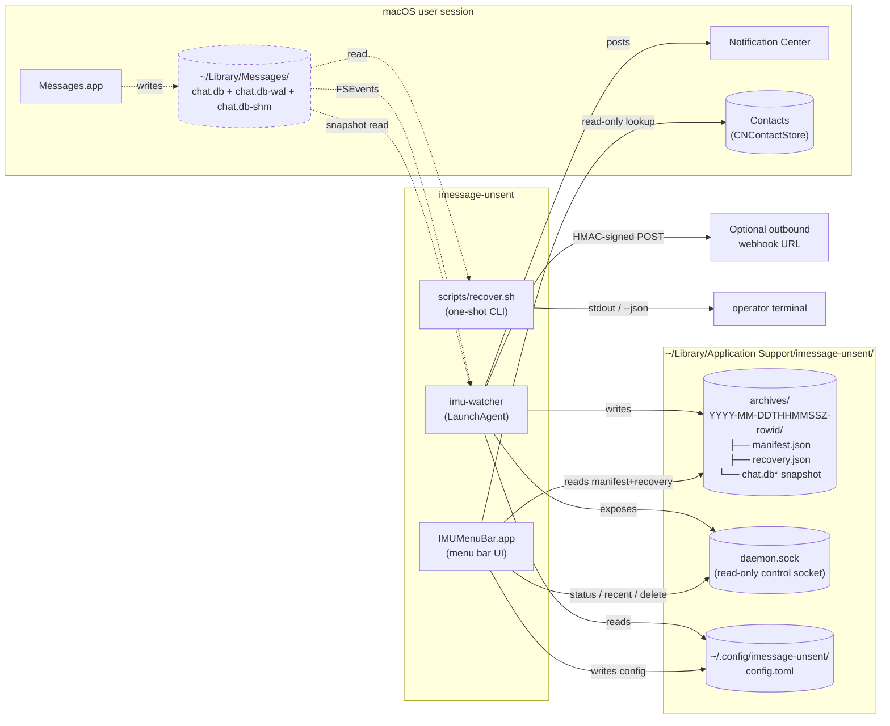
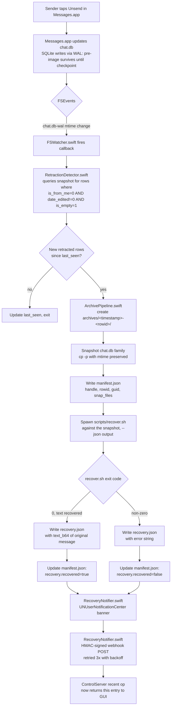

# Architecture

`imessage-unsent` recovers retracted iMessage text by snapshotting `chat.db` and forensically reading the WAL before SQLite checkpoints away the original bytes. The system is three components — a shell-based CLI, a Swift daemon, and a SwiftUI menu bar app — all of which read from the same Messages database and converge on a single on-disk archive layout.

The diagrams below render natively on GitHub. They're the ground truth for "how does a retraction become an archive on disk?". For per-vector implementation detail (what `recover.sh` actually does inside its six recovery vectors), see [`docs/recovery-vectors.md`](recovery-vectors.md).

## 1. System diagram

How the components fit together. The dashed arrows are *read-only* (especially `chat.db` — the project's Notify-only invariant means **no component ever writes to the live database**, codified by [`tests/bats/60-guardrail-no-chatdb-writes.bats`](../tests/bats/60-guardrail-no-chatdb-writes.bats) and [`RestoreModeGuard.swift`](../daemon/Sources/IMUCore/RestoreModeGuard.swift)).



Key invariants the diagram encodes:
- **`chat.db` is read-only to every component.** The CLI, daemon, and GUI all open it `read-only` (the daemon never even opens it write-mode at the file-handle level — see [`FSWatcher.swift`](../daemon/Sources/IMUCore/FSWatcher.swift)). This is enforced by [`60-guardrail-no-chatdb-writes.bats`](../tests/bats/60-guardrail-no-chatdb-writes.bats), which sha256s the live database before and after a recovery run.
- **The control socket is read-only by default.** [`ControlServer.swift`](../daemon/Sources/IMUCore/ControlServer.swift) only allows `ping`, `status`, `recent`, and `delete` (the last one only removes the daemon's own archive directories — never `chat.db`). All other ops return `{"ok": false, "error": {"code": "read_only"}}`.
- **The GUI never talks directly to `chat.db`.** It reads archive contents from disk (the daemon already wrote them) and uses the control socket for live state. This keeps the GUI usable without Full Disk Access.

## 2. Detection data flow (one retraction → one archive)

What happens, end-to-end, when someone you're chatting with unsends a message:



Code references for the boxes above:
- `FSWatcher` — [`daemon/Sources/IMUCore/FSWatcher.swift`](../daemon/Sources/IMUCore/FSWatcher.swift), tested in [`FSWatcherTests.swift`](../daemon/Tests/IMUCoreTests/FSWatcherTests.swift)
- `RetractionDetector` — [`daemon/Sources/IMUCore/RetractionDetector.swift`](../daemon/Sources/IMUCore/RetractionDetector.swift), tested in [`RetractionDetectorTests.swift`](../daemon/Tests/IMUCoreTests/RetractionDetectorTests.swift)
- `ArchivePipeline` — [`daemon/Sources/IMUCore/ArchivePipeline.swift`](../daemon/Sources/IMUCore/ArchivePipeline.swift), tested in [`ArchivePipelineTests.swift`](../daemon/Tests/IMUCoreTests/ArchivePipelineTests.swift)
- `RecoveryNotifier` — [`daemon/Sources/IMUCore/RecoveryNotifier.swift`](../daemon/Sources/IMUCore/RecoveryNotifier.swift), tested in [`RecoveryNotifierTests.swift`](../daemon/Tests/IMUCoreTests/RecoveryNotifierTests.swift)
- `ControlServer` — [`daemon/Sources/IMUCore/ControlServer.swift`](../daemon/Sources/IMUCore/ControlServer.swift), tested in [`ControlServerTests.swift`](../daemon/Tests/IMUCoreTests/ControlServerTests.swift)
- End-to-end test that proves the whole loop: [`DaemonBinaryE2ETests.swift`](../daemon/Tests/IMUCoreTests/DaemonBinaryE2ETests.swift)

## 3. Sequence diagram (a retraction in real time)

The relative timing between subsystems. Times are illustrative — actual latencies depend on macOS load and disk speed; the watcher-to-detector latency is asserted under 500 ms by [`testWatcherToDetectorLatencyIsUnderFiveHundredMilliseconds`](../daemon/Tests/IMUCoreTests/RetractionDetectorTests.swift).

```mermaid
sequenceDiagram
    autonumber
    participant S as Sender (Messages.app)
    participant DB as chat.db / WAL
    participant FS as FSEvents
    participant W as FSWatcher
    participant D as RetractionDetector
    participant AP as ArchivePipeline
    participant R as recover.sh
    participant N as RecoveryNotifier
    participant G as Menu bar GUI

    Note over S,G: T+0.0s — original message arrives, daemon idle
    S->>DB: INSERT message (rowid=N, text="oops wrong chat")
    DB-->>FS: chat.db-wal grows
    FS-->>W: mtime change
    Note over W,D: Daemon archives nothing yet — message has<br/>date_edited=0, fails the retraction predicate

    Note over S,G: T+30.0s — sender taps "Unsend"
    S->>DB: UPDATE message SET date_edited=t, is_empty=1, text=NULL WHERE rowid=N<br/>(written through WAL — pre-image preserved until checkpoint)
    DB-->>FS: chat.db-wal mtime change

    FS-->>W: mtime change<br/>(T+30.05s)
    W->>D: callback(walSize)
    D->>DB: SELECT … WHERE date_edited > last_seen AND is_empty=1<br/>(reads daemon's read-only handle on chat.db)
    DB-->>D: rowid=N, handle=+1555…, guid=…
    D->>AP: handle retraction(rowid=N)

    AP->>DB: cp -p chat.db chat.db-wal chat.db-shm → archives/&lt;ts&gt;-N/<br/>(snapshot is the read-only invariant)
    AP->>AP: write manifest.json (pre-recovery)
    AP->>R: spawn recover.sh --rowid N --json (against snapshot)

    R->>R: Vector 0–4: walk the WAL bytes, decode the streamtyped<br/>NSAttributedString, extract original text
    R-->>AP: stdout JSON: {recovered: {text_b64: "…"}}

    AP->>AP: write recovery.json + update manifest.json
    AP->>N: notifyRecovery(handle, text)
    par Notification + Webhook
        N->>N: UNUserNotificationCenter banner (T+30.6s)
    and
        N->>N: HMAC-signed POST to webhook (if configured)
    end

    Note over G: GUI poll interval = 2s
    G->>D: control socket: {"op":"recent","limit":5}
    D-->>G: includes the new archive entry
    G->>G: HistoryWindow row appears (T≤32s)
```

What this tells you to watch for:
- **The WAL is racing checkpoint.** Every second between T+30.0s and the snapshot at T+30.05s is a second SQLite has to checkpoint the WAL and erase the original text. This is why [`FSWatcher`](../daemon/Sources/IMUCore/FSWatcher.swift) is push-driven (FSEvents) and not poll-driven, and why the [`testWatcherToDetectorLatencyIsUnderFiveHundredMilliseconds`](../daemon/Tests/IMUCoreTests/RetractionDetectorTests.swift) assertion exists.
- **Notifications and webhook fan out in parallel** so a slow webhook never blocks the user-facing banner.
- **The GUI does not push** — it polls the control socket every 2 s ([`MenuBarModel.swift`](../gui/Sources/IMUMenuBarCore/Stores/MenuBarModel.swift)). Worst-case freshness is ~2 s after the daemon writes the manifest.

## Where to go next

- The README has the [conceptual overview of why each recovery vector exists](../README.md#the-six-recovery-vectors).
- [`docs/recovery-vectors.md`](recovery-vectors.md) is the per-vector implementation reference: code paths, files read/written, failure modes.
